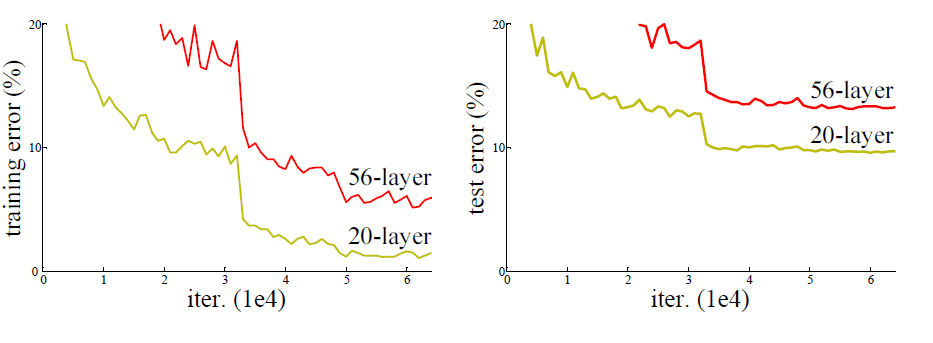
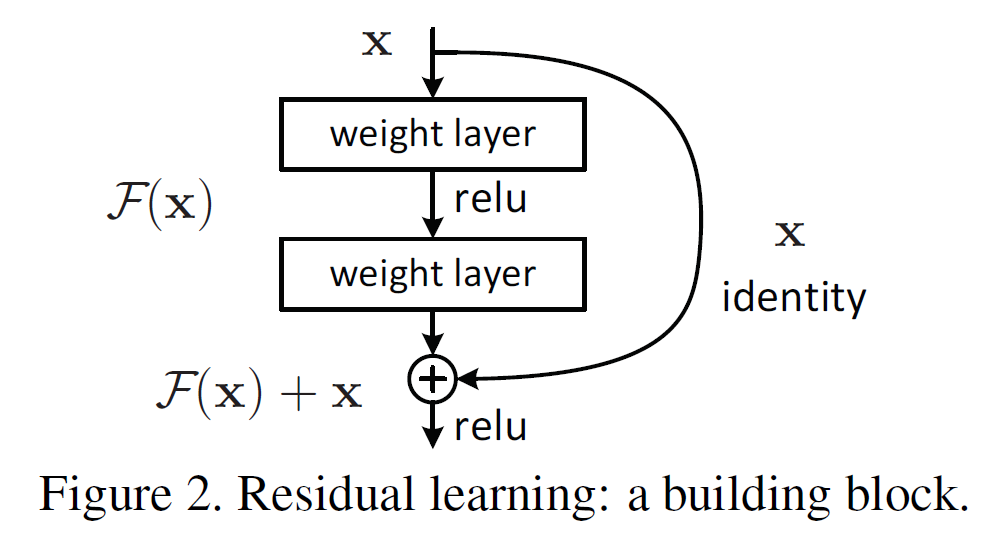

`2015年` 论文地址：  [https://arxiv.org/pdf/1512.03385.pdf](https://arxiv.org/pdf/1512.03385.pdf"论文地址")

## 通常情况下

1. 神经网络层越深，特征的抽象程度越高，模型的表达能力越强，语义信息越丰富；
2. 同时，网络越深，`退化问题` 越难解决;

## 退化问题是网络加深的障碍
　　简单的增加深度，会导致 `梯度弥散` 或者 `梯度爆炸` ,可以通过标准初始化和中间层正则化（batchNorm）解决；但是随着继续增加深度，训练集准确率饱和，甚至下降（` 退化问题 `，不属于过拟合）。

　　神经网络就像一个｀Function Set｀，网络是输入 x 到输出 out 的映射关系 F，`out = F(x)` ，所以网络层越深，这个 `Set` 包含的函数越复杂，那能够拟合的情况就更多（意思是解决的问题就更多），上图是作者在`CIFAR-10` 数据集上的对比实验，56层网络是在20层网络上的重复叠加（最差也应该是前22层的恒等映射），但是较深网络训练集的误差却比浅层网络的误差更大。这不是过拟合了，过深网络出现了 `退化问题`。

## 本文效果（很大程度上解决了退化问题）：

1. 作者在ImageNet上实验了一个152层的残差网络，比VGG深8倍，取得了3.57%的错误率。
2. 作者通过一系列实验证明了表示的深度（即网络的深度）对很多视觉识别任务都至关重要。仅仅由于使用了非常深的网络，作者就在COCO目标检测数据集上获得了28%的相对提升。

## 本文怎么解决退化问题？

### Resnet 结构分析

#### ResNet 短连接块

作者在《Identity Mapping in Deep Residual Networks 》一文中，推导了为什么短连接更容易训练，也提出了新的短连接块结构。
#### 为什么 ResNet build block 更容易训练？ 
##### 前向传播中帮助网络中一些层更容易实现恒等映射：

　　***出现了第一幅图的退化问题，这里假设深层网络的后边层都变成了恒等映射 ，那网络就退化成了浅层网络***（因为网络很深，所以其中肯定包括了多余的层，这些层会形成恒等映射 关系），原来的直接多个层堆叠的非线性层去直接学习 恒等映射 优化起来复杂，而加了上图的 `短连接`块之后，学习 恒等映射 变容易了。
##### 反向传播中
>　　因为网络中存在`恒等映射的短连接通道`，假设不加residual模块的输出为h(x)。x=10,h(x)=11,h(x)简化为线性运算Wh​, Wh明显为1.1，加了redidual模块后，F(x)=1, H(x)=F(x)+x=11，F也简化为线性运算,对应的WF为0.1。当标签中的真实值为12，反向传播的损失为1，而对于F中的参数和h中参数回传的损失实际上是一样大的而且梯度都是x的值，但是对于F的参数就从0.1到1.1扩大了十倍多，而h的参数是从1.1到2.1扩大不到2倍，因此redidual模块会明显减小模块中参数的值从而让网络中的参数对反向传导的损失值有更敏感的响应能力，虽然根本上没有解决回传的损失小得问题，但是却让参数减小，相对而言增加了回传损失的效果，也产生了一定的正则化作用。 
[https://blog.csdn.net/weixin_43624538/article/details/85049699?from=timeline&isappinstalled=0](https://blog.csdn.net/weixin_43624538/article/details/85049699?from=timeline&isappinstalled=0"该部分参考这里")

