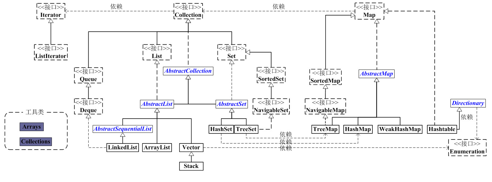

Java 集合类都在java.util包中，提供了如可变长数组，集合，队列，堆栈，链表等数据结构。
宏观上看整个结构可以分为两大部分： 属于单列集合Collection 接口和带映射的多列集合的Map接口。

-	[**Collection**](www.elgong.top) 接口：集合的基本操作和属性

	- **List** 接口：有序列表
		- [**ArrayList**](www.elgong.top)：  可变长的数组。 
		- [**LinkedList**](www.elgong.top)： 双端队列的链表结构。 

	- **Set** 接口： 不重复元素的集合
		- [**HashSet**](www.elgong.top)： HashMap 实现的，无序。
		- [**TreeSet**](www.elgong.top)：  HashMTree 实现的，有序。
	- **Queue** 接口： 
		- **Deque** 接口：  [**LinkedList**](www.elgong.top)

-	[**Map**](http://zhuzhuyule.xyz) 接口：key-value键值对的映射接口
	- [**HashMap**](http://zhuzhuyule.xyz)：*数组+链表* 组成的哈希表，无序。
	- [**TreeMap**](http://zhuzhuyule.xyz)：基于 *红黑树的排序顺序* 存储键/值对，有序。
	- [**Hashtable**](http://zhuzhuyule.xyz)： HashMap类很相似，支持同步。

**两个工具类**：

- **Arrays**
- **Collections**

