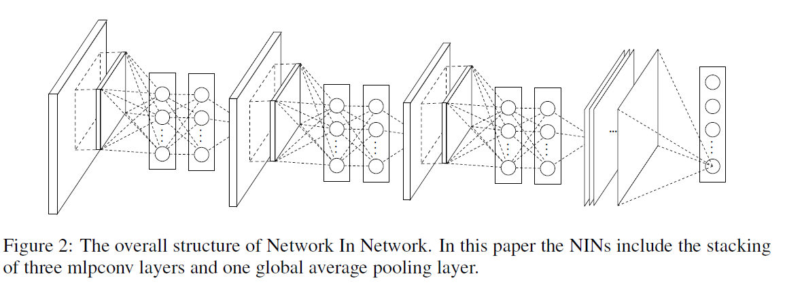

`2014年` 论文地址：  [https://arxiv.org/abs/1312.4400](https://arxiv.org/abs/1312.4400 "论文地址")

## 论文核心

NIN特点: 

- 微型网络: 
	- 增强模型在感受野（receptive field）内对局部区域的辨别能力;  

- GAP全局平均池化: 
	- 强化了特征图与分类的对应关系;
	- GAP本身是结构化的正则化器，能避免整体结构的过拟合；

	

> 　　卷积层使用线性滤波器（卷积核）来扫描输入，后面接一个非线性激活函数。而卷积核是广义线性模型（generalized linear model ）GLM，抽象程度低（该特征对同一概念的变体是不变的）,用更有效的 `非线性函数逼近器` 代替 `GLM` 可以增强局部模型的抽象能力。当样本的隐含概念（latent concept）线性可分时，GLM可以达到很好的抽象程度，例如：这些概念的变体都在GLM分割平面的同一边，而传统的CNN就默认了这个假设——认为隐含概念（latent concept）是线性可分的。然而，同一概念的数据通常是非线性流形的（nonlinear manifold），捕捉这些概念的表达通常都是输入的高维非线性函数。在NIN中，GLM用“微型网络”结构替代，该结构是一个`非线性函数逼近器`。  
> 
> 　　本文作者选择多层感知器实例化微型网络，该感知器是一个通用函数逼近器，也是一个通过反向传播训练的神经网络。

该图是 单独的 `mlpconv 层`。
这里有没有尝试过其他微型网络结构？？？？（可创新吗）
- 
## NIN 网络结构

　　NIN 的整体结构是一系列 `mlpconve层` 的堆叠，最上层接一个 `GAP层` 和 `分类层`。 `mlpconv层` 间的子层可以被相加，像CNN和maxout网络一样。上图展示了一个包含三个mlpconv层的NIN。每个mlpconv层，包含一个三层的感知器，NIN和微型网络的层数都是灵活的，可以根据具体任务微调。

　　这里没有采用传统CNN的 `全连接层` 进行分类，而是直接通过 `全局平均池化层（GAP）`输出最后一个 `mlpconv层特征图`的空间平均值作为类别的置信度值，然后将得到的向量输入 `softmax层`。