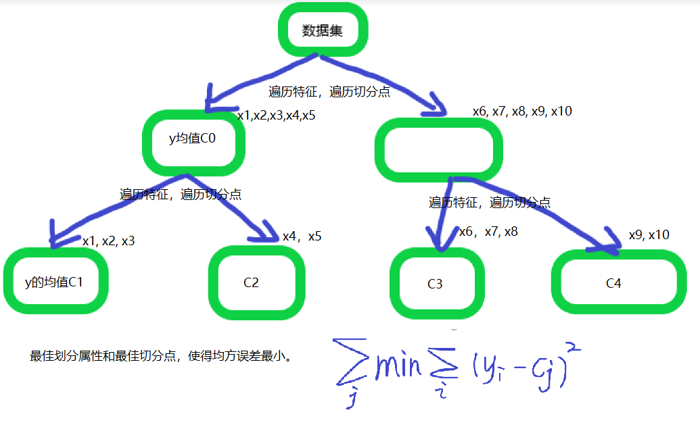

# CART-分类回归树

### CART 算法的思路

> 特征选择：最优属性划分依据是 基尼系数（分类）/平方误差（回归）； 

> CART 树是二叉树结构。

主要就两步骤：

1. 树的生成 
2. 树的剪枝

### 分类树

> 分类树与ID3, C4.5的流程一致。

### 回归树

> 回归树选择最佳划分属性和划分点时的依据是 `平方误差`。

一张图即可理解。

与分类树的主要区别是选择最佳属性的评价指标变了。根据最小化均方误差的原则选择。

