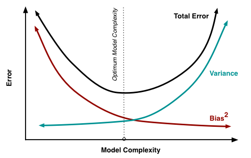

# 机器学习的方差与偏差

> 方差与偏差，总是迷迷糊糊的，每次看了就会，过了就忘。今天看到一个非常棒的解释，迫不及待马上整理下来了。

## 机器学习的目标函数
机器学习模型学习的是数据集的条件概率分布，得到一个决策函数。整个学习过程围绕着最小化（或者最大化）目标函数进行优化参数，目标函数的通常形式的定义是：

    Obj = L(θ) + λΩ(θ)
    
`L(θ)` 是损失函数，衡量模型对训练集拟合程度的好坏(对应偏差)；

` Ω(θ)` 是正则项，是衡量模型的复杂程度（对应方差）；

 目标函数定义为损失函数和正则项两部分，是为了平衡模型的偏差和方差（Bias Variance Trade-off）。 

## 偏差与学习器

> 偏差描述了 学习器的拟合能力 （对训练集的）。

学习器在训练集表现越好，损失越低，则模型的偏差越小。

## 方差与学习器

> 方差描述了  学习器的泛化能力(对测试集)。

学习器在测试集表现越好，则模型的方差越低。

## 偏差与方差之间的关系

> 我们最想要的是低偏差，低方差的模型，然而现实很难达到两者都极致的低。有时候需要用提高偏差来降低方差，毕竟模型的泛化能力十分重要。

当损失函数达到极小值，模型对训练集的拟合达到了最佳效果，==对应着低偏差==，而这种情况下，往往对训练集的特点学的过于细微，而缺乏泛化能力。

根据 ==奥坎姆剃刀原则==, 同样准确率，模型越简单越好，所以通过正则化等方式，削弱模型的拟合能力，降低过拟合的风险。通过提高偏差，来主动降低方差。

最终我们要平衡方差与偏差，从而得到一个合理的模型。

   

## 调整方差与偏差的方法

待补充。。。