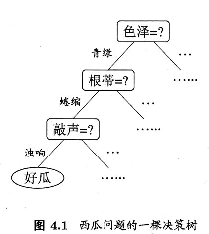

适用任务： 分类、回归

> 优点：对中间值缺失不敏感，可以处理不相关特征数据。

> 缺点：存在过度匹配问题。

## 数据格式

> 有数据集 D = {(x1, y1), (x2, y2), (x3, y3) ... (xm, ym)}，总共 m 个样本，样本的属性集合 A = {a1, a2, a3, a4 ...}

## 决策树的构建

### 决策树的外貌

上图即决策树的树形。构建决策树过程中，** 根据来属性划分 **。每个结点选择当前最优的属性作为划分依据，将样本集合不断的划分成不同的子集合，子集合中样本类别一致或者没有可以划分的属性值，则停止划分，标记为叶结点。

### 递归构建过程

> 决策树采用递归构建。

待补充

### 如何选择最优划分属性？

> 划分目标: 划分出的新的结点（即样本子集合）尽可能属于同类别，即 **纯度** 越来越高。

因此，需要计算出划分后子集合的 **纯度** ，找到 **纯度** 最高的划分方式。

 **纯度** 的衡量方法:

1. 信息熵  - information entropy

2. 信息增益 - information gain

	> 偏向的属性: 属性可以取的值很多，信息增益相对越大

3. 增益率  - gain ratio

	> 偏向的属性: 属性可以取的值很少，信息增益率相对越大

4. 基尼系数  - Gini index

### 对抗过拟合 -- 剪枝处理

> 分支太多，容易过拟合，泛化能力变差。所以要适当剪枝，常用方法是**预剪枝**和**后剪枝**

#### 预剪枝

1. 预剪枝是在决策树生成的过程中，对每个结点在划分前先估计，根据划分前后验证集的精度，来决定是否划分；

2. 只能估计当前结点可划分性，不能预测到未来节点划分的必要性，是贪心算法；

3. 容易造成欠拟合。

#### 后剪枝

1. 先生成完整的树，再从叶结点往回计算，根据验证集精度是否提升决定是否剪枝；

2. 泛化能力往往优于预剪枝，欠拟合风险小；

3. 时间开销大。

## 属性为连续值时？

> C4.5 算法采用二分法将连续值离散化

> 与离散属性不同，连续的属性可以在后代节点中再次使用

## 当数据中含有缺失值时？

处理方法：

通过无缺失数据计算出三个参数：

1. 无缺失样本占总样本比例 
2. 无缺失样中 `K类别` 占比 `pk`
3. 无缺失样本中 `v 属性`样本占比 `rv`

对单样本增加一个权值 `Wx`, 无缺失样本的`Wx = 1`，  有缺失样本的`Wx = rv*Wx `。

在计算分支时，**同一样本以不同的概率划分到不同的子节点中**

- 当样本的属性已知：则把该样本划分进对应的子节点，权值=1；

- 当样本的该属性缺失：则把该样本同时划入所有的子节点，样本权值需要更新为`Wx = rv*Wx。

## 常用的决策树算法比较

