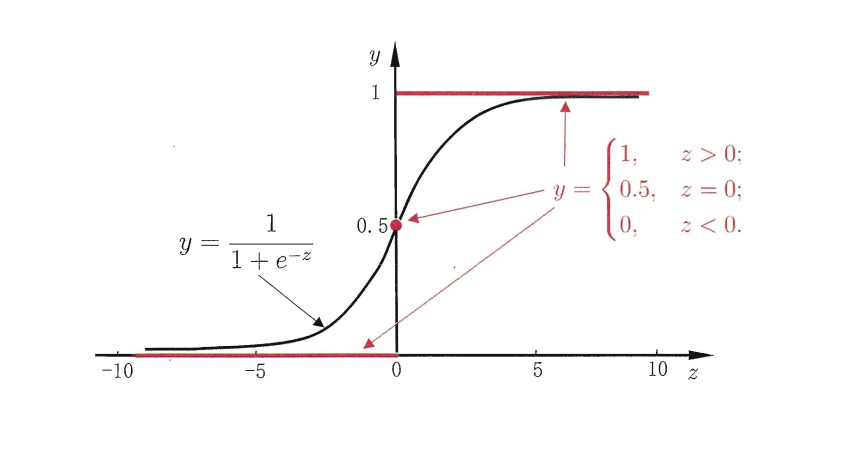

> 逻辑回归就是西瓜书里的对数几率回归，名为回归，实际则是分类算法。其实质是利用线性回归模型的预测结果来逼近真实标记的对数几率。
> 
一句话概括就是:
 
逻辑回归假设数据服从 **伯努利分布** ,通过 **极大化似然函数** 的方法，运用 **梯度下降** 来求解参数，来达到将数据二分类的目的。

## 线性模型如何处理二分类问题？

> 在处理二分类任务时，我们希望模型能预测样本属于某类别的概率[0, 1]，或者直接输出类别的标签{0, 1}。 线性模型不能直接来完成这项任务，因为其输出是一个实际值，范围也不一定在0~1之间，无法体现我们所想要的概率或者标签。

$$
y=\boldsymbol{w}^{\mathrm{T}} \boldsymbol{x}+b
$$

因此，我们需要找到一种能把线性模型输出映射到 **概率** 或者 **标签** 的方法；

- 如何转化为标签？

	单位阶跃函数

- 如何转化为概率？

	sigmoid函数 (二分类): 将无穷范围的值限制在(0, 1)之间
 
	softmax函数（多分类）: 所有类别概率和为1

由于单位阶跃函数存在跳跃点，在跳跃点不可导，想选择梯度下降法来优化时，只能选择sigmoid函数了。

## 逻辑回归模型

> 逻辑回归就是这样的一个过程：面对一个分类问题，建立代价函数，然后通过优化方
法迭代求解出最优的模型参数，然后测试验证我们这个求解的模型的好坏。

### 逻辑回归的优缺点

- 优点 

	- 速度快，适合二分类问题
	
	- 简单易于理解，直接看到各个特征的权重

	- 能容易地更新模型吸收新的数据

- 缺点

	- 对数据和场景的适应能力有局限性，不如决策树算法适应性那么强

### 逻辑回归的用途

- **寻找主要影响因素**：  通过学习到的权重值，得到不同因素对结果的影响力大小

- **预测**：  预测事件发生的概率

### 建模常规步骤

- 寻找 `h 函数`（预测函数）

- 构造 `J 函数` (损失函数)

- 利用梯度下降等方法最小化  `J 函数`，并求取参数

### LR基本模型

以下就是逻辑回归的基本模型：

$$
y=\frac{1}{1+e^{-z}}
$$

$$
z=w^{\top} x+b
$$

取倒数

$$
\frac{1}{y}=1+e^{-z}
$$

取对数

$$
\ln \left(\frac{1}{y}-1\right)=-z
$$

$$
\ln \frac{y}{1-y}=\boldsymbol{w}^{\mathrm{T}} \boldsymbol{x}+b
$$
 

ln(y/(1-y)) 就是对数几率

## 代价函数

线性模型常用的目标函数 `均方误差` 用在逻辑回归模型是非凸函数，非凸函数通过梯度下降法容易陷入局部最小值，因此需要想办法找到代价函数，且代价函数为凸函数。

### 极大似然法定义代价函数
这里通过极大似然估计的方法来定义目标函数：

> **极大似然估计**： 这里想了很久才算有点理解，之前就一直卡在这里。。极大似然估计就是可以利用已知数据来推测出产生这些数据的最可能的环境条件。

> 举个栗子，当我们扔硬币时，出现的可能性有两个，要么正面朝上（事件A），要么反面朝上(事件B)，假设出现某事件的可能性只与硬币的 `质量分布θ` 有关系，假设我们做了n组实验（A出现m次），这样能得到两种情况的概率 P(A), P(B),我们要推测出 `质量分布θ` 是多少，也就是 `参数估计` ,即 `质量分布θ` 是多少时，才最可能出现当前实验的结果。抛硬币的事件服从二项分布，那么给定了一组实验的情况下，似然函数是(似然函数与概率值相等)：
> $$
L\left(\theta ; x_{1}, \ldots, x_{n}\right)=f\left(x_{1}, \ldots, x_{n} ; \theta\right)=\prod_{i=1}^{n} P\left(X=x_{i}\right)=\theta^{m}(1-\theta)^{n-m}
$$

假设一个数据集`Cn`,标签`y∈{0,1}`，预测值`Θ`,模型参数为`w`则似然函数可以写作:

$$
P\left( \theta _{\left( x_i \right)}|w \right) =\prod_{n=1}^N{\theta}_{xi}^{yi}\cdot \left( 1-\theta _{\left( x_i \right)} \right) ^{1-y_i}
$$

取对数简化运算:

$$
\mathrm{L}(\mathrm{w}, \mathrm{b})=\sum_{i=1}^{N}\left[y_{i} \log \left(\emptyset\left(x_{i}\right)\right)+\left(1-y_{i}\right) \log \left(1-\emptyset\left(x_{i}\right)\right)\right]
$$

实际代价函数的样子:

$$
\mathrm{J}(\mathrm{w}, \mathrm{b})=-\frac{1}{N} \mathrm{L}(\mathrm{w}, \mathrm{b})=-\frac{1}{N} \sum_{i=1}^{N}\left[y_{i} \log \left(\emptyset\left(x_{i}\right)\right)+\left(1-y_{i}\right) \log \left(1-\emptyset\left(x_{i}\right)\right)\right]
$$

取对数之后的公式很符合理想的代价函数，当实际标签与预测结果相同，则代价为0，而相反时，会随着差值越大，损失越大。

因为
$$
\operatorname{logit}(\mathrm{p})=\log \frac{p}{1-p}
$$

$$
\log \frac{P(Y=1 | X)}{1-P(Y=1 | X)}=w \cdot x+b
$$

带入后继续化简
$$
\mathrm{L}(\mathrm{w}, \mathrm{b})=\sum_{i=1}^{N}\left[y_{i}\left(\mathrm{w} \cdot x_{i}+\mathrm{b}\right)-\log \left(1+e^{\mathrm{w} \cdot x_{i}+b}\right)\right]
$$

### 直观解释

直观上理解，代价函数就是分类错误的惩罚，那么当y=1时，prediction 越小时，损失应越大；y=0时prediction 越大时，损失应越小。

$$
\operatorname{cost}=\left\{\begin{aligned}-\log (\hat{p}), & \text { if } y=1 \\-\log (1-\hat{p}), & \text { if } y=0 \end{aligned}\right.
$$

## 通过梯度下降来最小化代价函数

因为我们找到的代价函数是凸函数，所以可以尝试用梯度下降来找到合适的参数w，b：

$$
\mathrm{w} :=\mathrm{w}-\alpha \frac{\partial J(w, b)}{\partial w}
$$

$$
\mathrm{b} :=\mathrm{b}-\alpha \frac{\partial J(w, b)}{\partial b}
$$

偏导求解过程：

对w求偏导

$$
\frac{\partial J(w, b)}{\partial w}=-\frac{1}{N} \sum_{i=1}^{N}\left[y_{i} \frac{1}{\partial\left(x_{i}\right)}-\left(1-y_{i}\right) \frac{1}{1-\emptyset\left(x_{i}\right)}\right] \frac{\partial \emptyset\left(x_{i}\right)}{\partial w}
$$

$$
=-\frac{1}{N} \sum_{i=1}^{N}\left[y_{i} \frac{1}{\emptyset\left(x_{i}\right)}-\left(1-y_{i}\right) \frac{1}{1-\emptyset\left(x_{i}\right)}\right] \sigma\left(x_{i}\right)\left(1-\emptyset\left(x_{i}\right)\right) \cdot x_{i}
$$

$$
=-\frac{1}{N} \Sigma_{i=1}^{N}\left(y_{i}-\emptyset\left(x_{i}\right)\right) \cdot x_{i^{*}}
$$

对b求偏导

$$
\frac{\partial J(w, b)}{\partial b}=-\frac{1}{N} \sum_{i=1}^{N}\left[y_{i} \frac{1}{\emptyset\left(x_{i}\right)}-\left(1-y_{i}\right) \frac{1}{1-\emptyset\left(x_{i}\right)}\right] \frac{\partial \emptyset\left(x_{i}\right)}{\partial b}
$$

$$
=-\frac{1}{N} \sum_{i=1}^{N}\left[y_{i} \frac{1}{\emptyset\left(x_{i}\right)}-\left(1-y_{i}\right) \frac{1}{1-\emptyset\left(x_{i}\right)}\right] \wp\left(x_{i}\right)\left(1-\emptyset\left(x_{i}\right)\right)
$$

$$
=-\frac{1}{N} \Sigma_{i=1}^{N}\left(y_{i}-\emptyset\left(x_{i}\right)\right)
$$

带入公式后，得到最终推导的结果：

$$
\mathrm{w} :=\mathrm{w}+\alpha \frac{1}{N} \sum_{i=1}^{N}\left(y_{i}-\emptyset\left(x_{i}\right)\right) \cdot x_{i}
$$

$$
\mathrm{b} :=\mathrm{b}+\alpha \frac{1}{N} \sum_{i=1}^{N}\left(y_{i}-\emptyset\left(x_{i}\right)\right)
$$

 
通过以上公式可以看出，逻辑回归的梯度与 `sigmoid` 本身无关，只与 `y` 和`x`和 `w` 有关系。

## 进一步提高泛化能力

> 影响模型泛化能力的主因素是 `过拟合`, 过拟合问题比较容易理解，这里就不贴图了。下面分析一下产生过拟合的原因和解决办法。

### 过拟合产生的原因有哪些？

**过多的特征**

### 怎么解决过拟合？

1. 减少特征数量

	减少特征数量会导致部分信息丢失。

2. 正则化

	保留所有的特征，并且减小参数的大小。

### 正则化方法

**在代价函数上增加一个惩罚项**，惩罚项应该是模型复杂度的单调递增函数，模型越复杂，惩罚项越大。 

回归问题中，取**平方损失**（L2 范数），或者L1范数

$$
J(\theta)=\frac{1}{2 m} \sum_{i=1}^{n}\left(\mathrm{h}_{\theta}\left(\mathrm{x}_{i}\right)-y_{i}\right)^{2}+\lambda \sum_{j=1}^{n} \theta_{j}^{2}
$$

这里的lambda 系数：

 如果它的值很大，说明对模型的复杂度惩罚大，对拟合数据的损失惩罚小，这样它就不会过分拟合数据，在训练数据上的偏差较大，在未知数据上的方差较小，但是可能出现欠拟合的现象；

 如果它的值很小，说明比较注重对训练数据的拟合，在训练数据上的偏差会小，但是可能会导致过拟合。

加入正则化后的参数更新：

$$
\theta_{j} :=\theta_{j}-\frac{\alpha}{m} \sum_{i=1}^{m}\left(h_{\theta}\left(x_{i}\right)-y_{i}\right) x_{i}^{j}-\frac{\lambda}{m} \theta_{j}
$$

## python 实现

空

## 参考资料

[极大似然估计](https://irwenqiang.iteye.com/blog/1552680"该部分参考这里")